# TXLFORMA - Plateforme de Gestion de Formations

## Vue d'ensemble

TXLFORMA est une plateforme web complète de gestion de formations professionnelles dans le domaine du numérique. Elle permet de gérer l'ensemble du cycle de vie des formations, de l'inscription des utilisateurs à la génération des attestations, en offrant une expérience fluide et intuitive pour les administrateurs, formateurs et apprenants.

Le projet s'appuie sur une architecture moderne et sécurisée, avec un frontend en React et un backend en Spring Boot, garantissant à la fois performance, modularité et fiabilité.

**🌐 Application en ligne :** [https://txlforma.vercel.app](https://txlforma.vercel.app)

---

## Fonctionnalités

### Gestion des Utilisateurs

- Création de compte personnel (email, mot de passe, coordonnées).
- Connexion / déconnexion sécurisée via Spring Security et JWT.
- Gestion des rôles : **Administrateur**, **Formateur**, **Utilisateur/Apprenant**.
- Accès différencié selon le rôle.
- Interface personnelle avec historique des inscriptions et attestations.

### Gestion des Formations et Sessions

- Création, modification et suppression de formations par les administrateurs.
- Association de sessions à chaque formation (dates, horaires, formateur, nombre de places).
- Limitation à 12 participants par session.
- Visualisation du catalogue de formations pour les utilisateurs.
- Consultation de l'historique des sessions et participants.

### Système d'Inscription et de Paiement

- Ajout de plusieurs sessions dans un panier.
- Vérification automatique qu'aucune session ne se chevauche (pas de conflit horaire).
- **Paiement sécurisé en ligne via Stripe** (intégration complète avec PaymentIntent et webhooks).
- Validation automatique de l'inscription après paiement réussi.
- Gestion des sessions de paiement et synchronisation.

### Gestion de la Présence et des Notes

- Signature électronique de présence sur la page de session.
- Marquage automatique de présence une fois la signature effectuée.
- Attribution de notes uniquement aux participants présents.
- Modification des notes possible uniquement pendant 14 jours après la session.
- Validation automatique de la réussite selon la moyenne des notes (≥ 10/20).

### Attestations et Statistiques

- Génération automatique d'attestations :
  - Attestation de présence (note < 10/20)
  - Attestation de réussite (note ≥ 10/20)
- Téléchargement des attestations depuis l'espace utilisateur.
- Blocage automatique de réinscription à une session déjà validée.
- Génération de statistiques globales (taux de réussite, chiffre d'affaires, fréquentation).
- Export des rapports en PDF.

### Tableaux de Bord

- **Administrateur** : Gestion complète des formations, sessions, utilisateurs, suivi des inscriptions et paiements, visualisation des statistiques.
- **Formateur** : Consultation des sessions attribuées, liste des participants, notation, historique des sessions.
- **Utilisateur** : Consultation des formations disponibles, historique des sessions, consultation des notes, téléchargement des attestations.

### Authentification & Sécurité

- Authentification par token JWT.
- Contrôle d'accès basé sur les rôles (RBAC).
- Chiffrement sécurisé des mots de passe.
- Protection des routes selon les permissions.

---

## Technologies Utilisées

### Frontend

- **Framework principal :** React 19, React DOM, React Router DOM 7
- **Build Tool :** Vite 7
- **UI Components :** Ant Design 6, Lucide React Icons
- **Styling :** Tailwind CSS 3, PostCSS, Autoprefixer
- **Communication API :** Axios
- **Visualisation de données :** Chart.js 4, React Chart.js 2 5
- **Animations :** Lottie React 2

### Backend

- **Framework :** Spring Boot 4.0.0
- **Langage :** Java 21
- **Sécurité :** Spring Security avec JWT (JJWT 0.13.0)
- **Authentification :** Contrôle d'accès basé sur les rôles (RBAC)
- **Intégration base de données :** Spring Data JPA, Hibernate
- **Architecture :** API RESTful
- **Build Tool :** Maven
- **Validation :** Spring Boot Starter Validation
- **Paiement :** Stripe Java SDK 24.16.0
- **Génération PDF :** iTextPDF 7.2.5 (kernel, layout)
- **Outils de développement :** Lombok, Spring Boot DevTools

### Base de données

- **TiDB** (compatible MySQL)
- **ORM :** Hibernate
- **Tables principales :** user, formation, session, participation, note, attestation, payment, panier, category, etc.

### Outils et Méthodologie

- **Gestion de projet :** Jira (Agile/Scrum)
- **Contrôle de version :** Bitbucket (GitFlow workflow)
- **Méthodologie :** Agile / Scrum avec sprints de 3 semaines
- **Design :** Figma
- **Documentation API :** Postman (collection disponible)

### Workflow de Développement

- **Workflow Git :** Chaque ticket Jira correspond à une branche Git
- **Processus :**
  1. Création d'une branche `feature` depuis `main` pour chaque ticket
  2. Développement de la fonctionnalité
  3. Rebase régulier sur `main` pour maintenir la branche à jour
  4. Création d'une Pull Request sur GitHub
  5. Review par au moins 2 membres de l'équipe
  6. Merge dans `main` après validation

### Hébergement et Déploiement

- **Frontend :** Vercel (https://txlforma.vercel.app) - hébergé séparément
- **Backend :** Render - hébergé séparément
- **Base de données :** TiDB

---

## Installation

### Prérequis

- Docker et Docker Compose installés sur votre machine

### Étapes d'installation avec Docker

1. Cloner le dépôt :

   ```bash
   git clone https://github.com/Athavv/txlforma.git
   cd txlforma
   ```

2. Créer un fichier `.env` dans le dossier `back` avec les variables d'environnement nécessaires :

   ```bash
   cd back
   cp .env.example .env  # Si un fichier .env.example existe
   ```

   Ou créer manuellement un fichier `.env` avec les variables suivantes :

   ```env
   SPRING_DATASOURCE_USERNAME=votre_username
   SPRING_DATASOURCE_PASSWORD=votre_password
   APP_JWT_SECRET=votre_secret_jwt_plus_de_32_caracteres
   STRIPE_SECRET_KEY=votre_cle_secrete_stripe
   STRIPE_WEBHOOK_SECRET=votre_webhook_secret_stripe
   VITE_API_BASE_URL=http://localhost:8080/api
   ```

3. Démarrer les services avec Docker Compose :

   ```bash
   cd back
   docker-compose up -d
   ```

   Cette commande va :

   - Démarrer la base de données sur le port 4000
   - Construire et démarrer le backend Spring Boot sur le port 8080
   - Construire et démarrer le frontend React sur le port 3000

4. Accéder à l'application :

   - Frontend : http://localhost:3000
   - Backend API : http://localhost:8080/api
   - Base de données TiDB : localhost:4000

5. Pour arrêter les services :

   ```bash
   docker-compose down
   ```

6. Pour voir les logs :

   ```bash
   docker-compose logs -f
   ```

---

## Utilisation

- Accéder à l'application en ligne : [https://txlforma.vercel.app/catalogue](https://txlforma.vercel.app/catalogue)
- Ou localement sur http://localhost:5173 (ou le port configuré par Vite).

- **En tant qu'administrateur**, vous pouvez :

  - Gérer les formations et sessions
  - Gérer les utilisateurs et formateurs
  - Suivre les inscriptions et paiements
  - Visualiser les statistiques
  - Générer des rapports

- **En tant que formateur**, vous pouvez :

  - Consulter vos sessions attribuées
  - Visualiser la liste des participants
  - Attribuer des notes aux participants présents
  - Consulter l'historique des sessions

- **En tant qu'utilisateur/apprenant**, vous pouvez :
  - Consulter le catalogue de formations
  - S'inscrire à des sessions (sans chevauchement horaire)
  - Effectuer le paiement en ligne via Stripe
  - Signer votre présence électroniquement
  - Consulter vos notes et télécharger vos attestations

## Documentation API

- Collection Postman disponible dans `back/TXLFORMA_API.postman_collection.json`

---

## Structure du Projet

```
osaas/
├── back/                    # Backend Spring Boot
│   ├── src/
│   │   └── main/
│   │       ├── java/        # Code source Java
│   │       └── resources/   # Configuration (application.properties)
│   ├── pom.xml              # Dépendances Maven
│   └── TXLFORMA_API.postman_collection.json
│
└── front/                   # Frontend React
    ├── src/
    │   ├── api/             # Services API
    │   ├── components/      # Composants React
    │   ├── pages/           # Pages de l'application
    │   ├── routes/          # Configuration des routes
    │   ├── contexts/        # Contextes React
    │   ├── constants/       # Constantes et configuration
    │   └── utils/           # Utilitaires
    ├── package.json         # Dépendances npm
    └── vite.config.js       # Configuration Vite
```

---

## Équipe de Développement

- **Aathavan Thevakumar** : Lead Développeur Back-end, Scrum Master, PO, Développeur Front-end, Designer 3D
- **Abi Vigneswaran** : Lead Développeur Front-end, Designer UI/UX, Designer 3D, Développeur Back-end
- **Oscar Baer** : Lead Designer 3D, Designer UI/UX, Documentaliste, Développeur Front-end, Développeur Back-end
- **Saffana Salaoudine** : Lead Designer UI/UX, Développeur Front-end, Designer 3D, Développeur Back-end

---

## Liens Utiles

- **🌐 Application en ligne :** [https://txlforma.vercel.app](https://txlforma.vercel.app)
- **🎨 Maquettes Figma :** [https://www.figma.com/design/IIxFP43GEJJ02mPZn4A57v/MAQUETTE-SAE?node-id=35-2&p=f&t=CQtLuFEOD6vgsu4l-0](https://www.figma.com/design/IIxFP43GEJJ02mPZn4A57v/MAQUETTE-SAE?node-id=35-2&p=f&t=CQtLuFEOD6vgsu4l-0)
- **📋 Gestion de projet Jira :** [https://osaass.atlassian.net/jira/software/projects/OSS/boards/1](https://osaass.atlassian.net/jira/software/projects/OSS/boards/1)

---

## Images du Site

**Page d'accueil :**

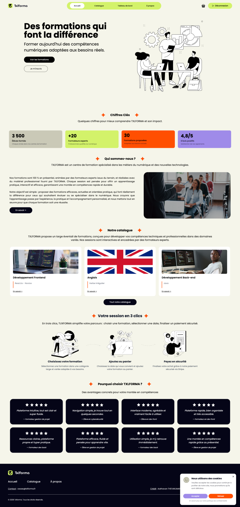

**Page de connexion :**

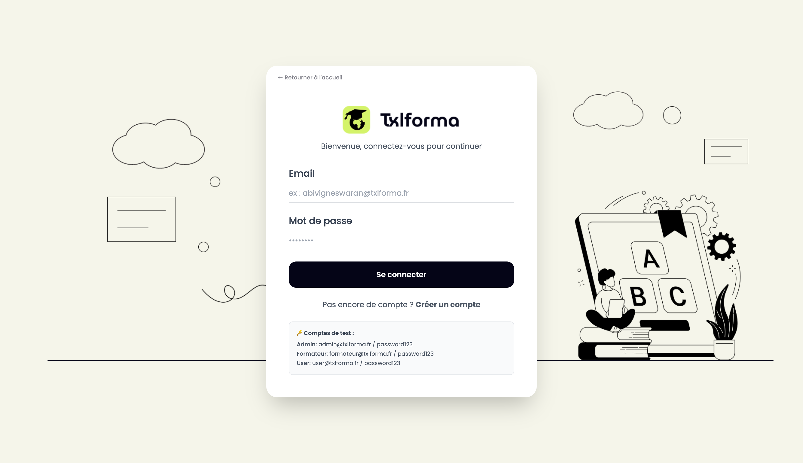

**Page d'inscription :**

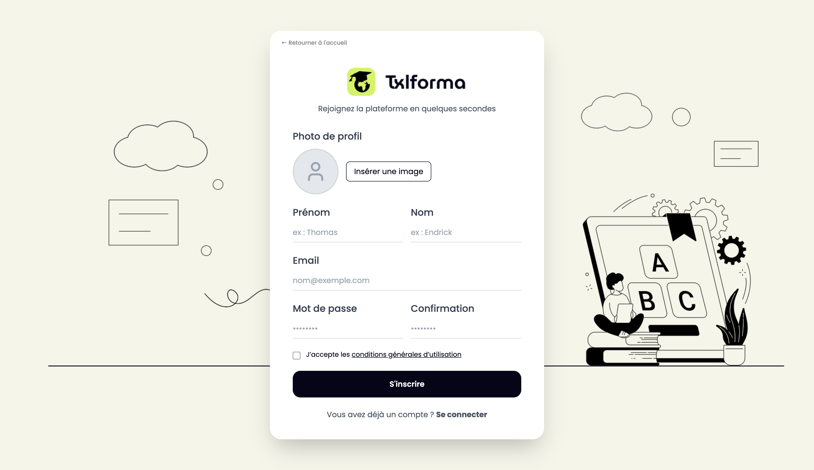

**Catalogue de formations :**

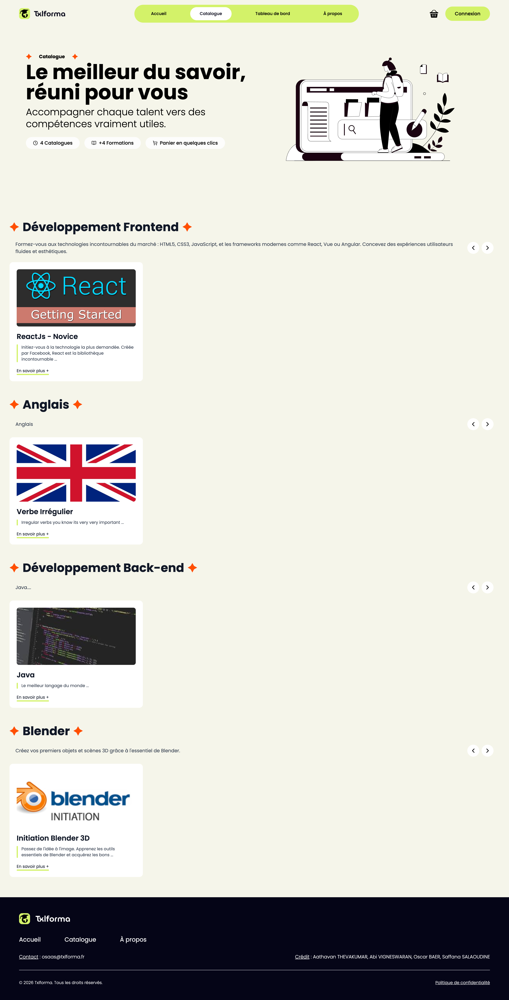

**Détail d'une formation :**

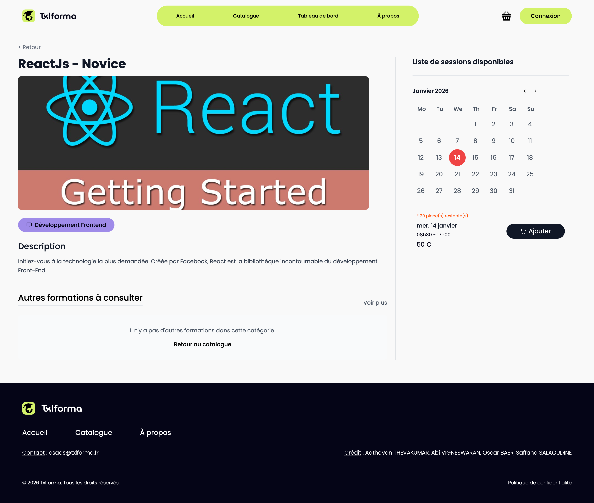

**Panier :**

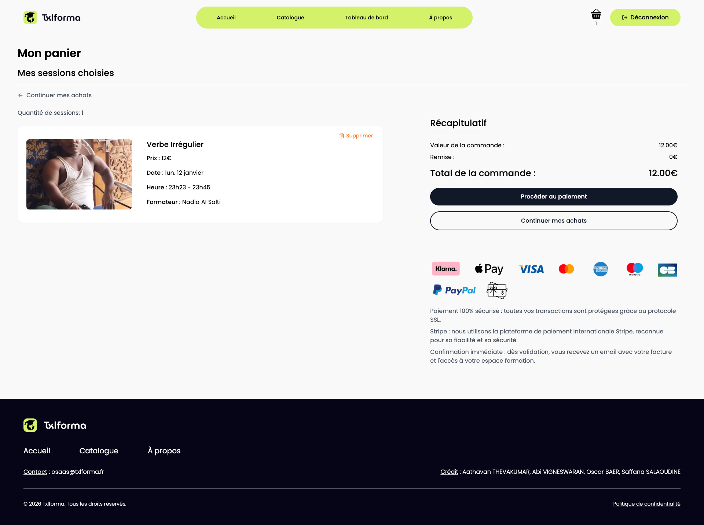

**Paiement Stripe :**

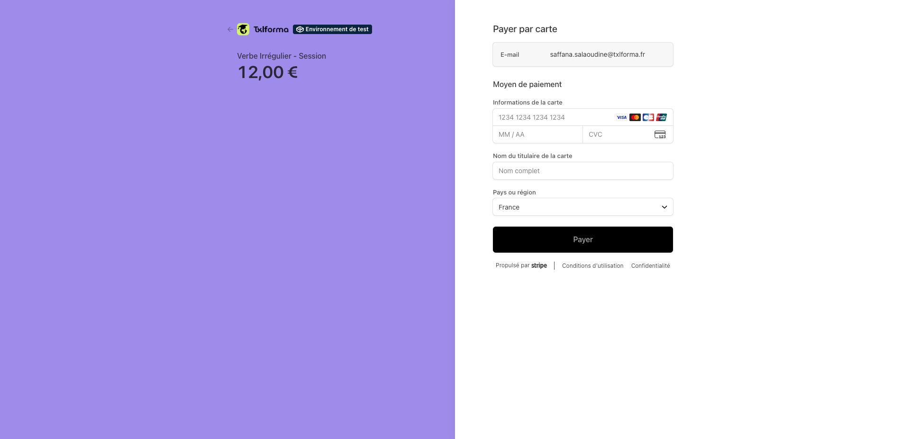

**Tableau de bord Administrateur :**

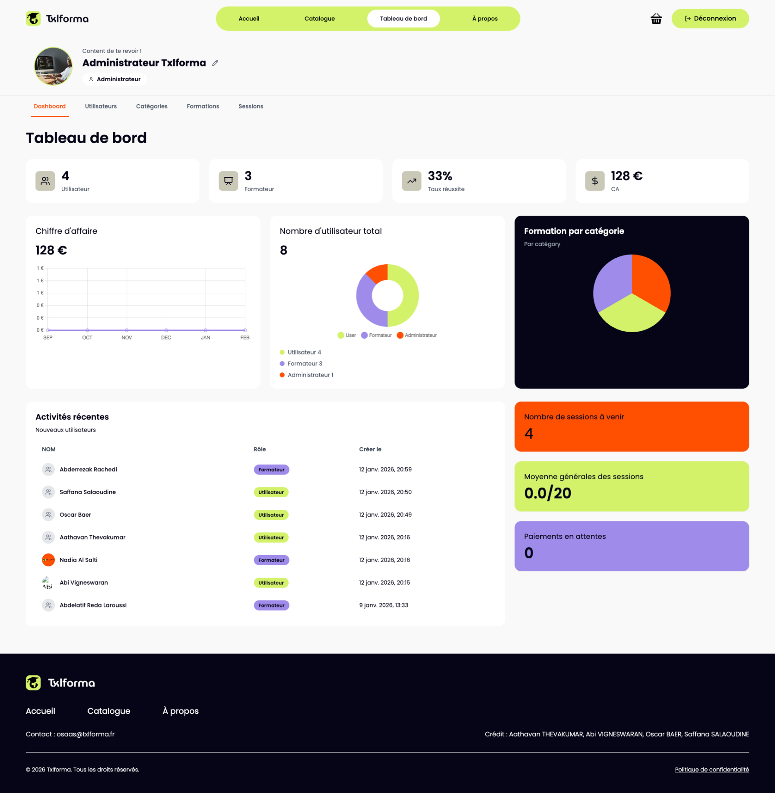

**Tableau de bord Formateur :**

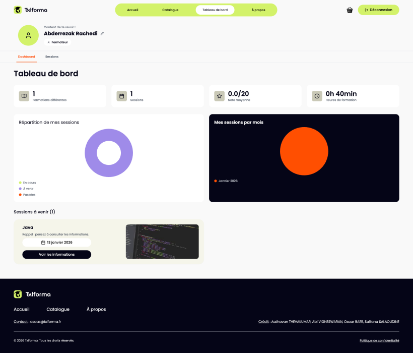

**Tableau de bord Utilisateur :**

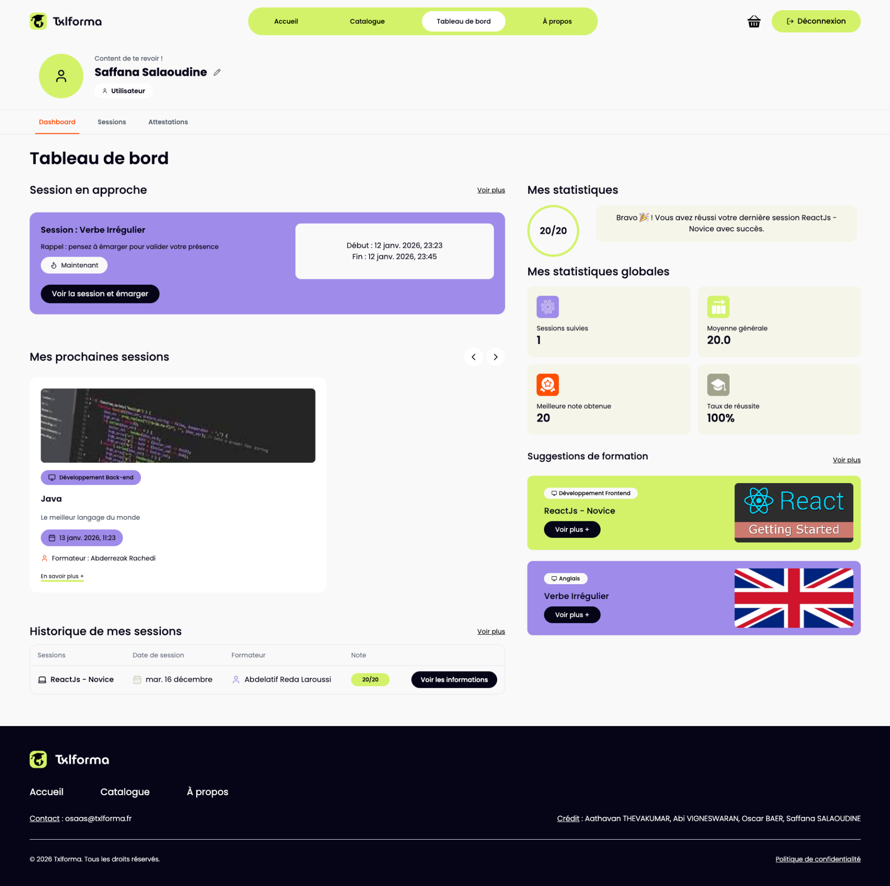

**Émargement :**

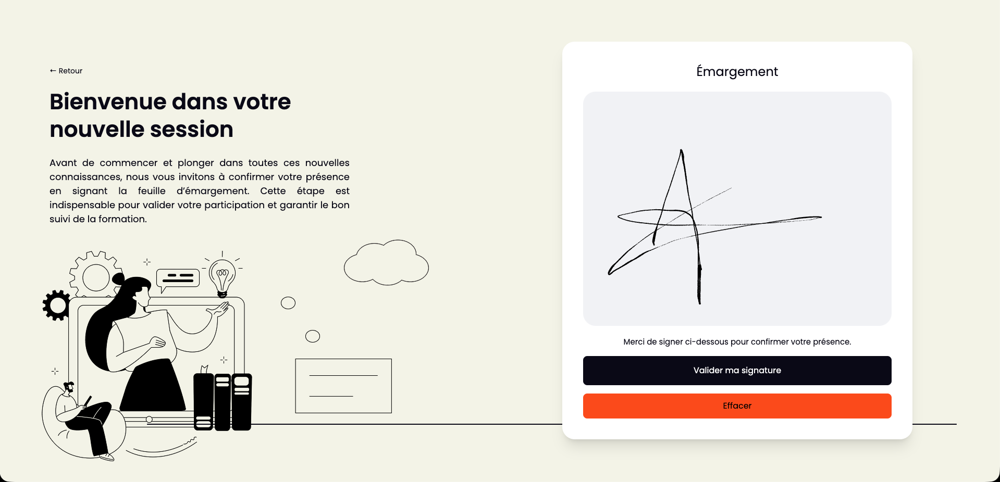

---

## Licence

Ce projet est développé dans le cadre d'un projet académique.

# txlforma
